# Milestone 3: Data Processing Service (Dataflow)

##  Repository: 
[https://github.com/GeorgeDaoud3/SOFE4630U-MS3.git](https://github.com/GeorgeDaoud3/SOFE4630U-MS3.git)

## Objective:
1. Get familiar with Dataflow.
2. Understand MapReduce patterns.
3. Run batch and Stream Processing examples over the MNIST dataset.

## Dataflow and a Simple Map Reduce Example:
In this section, you will learn about Dataflow, MapReduce pattern, and a word count as a MapReduce example. 
1. Watch this video about [Google Cloud Dataflow](https://www.youtube.com/watch?v=KalJ0VuEM7s).
2. Watch this video about [MapReduce concepts](https://www.youtube.com/watch?v=JZiM-NsdiJo).
3. Read this article about [implementing a word count example using the MapReduce patterns](https://www.analyticsvidhya.com/blog/2022/05/an-introduction-to-mapreduce-with-a-word-count-example/).

## Configure Dataflow
1. Open the GCP site.
2. Search for **Dataflow API**.
    
    
   
3. Click **Enable** and Wait until the GCP gets the service enabled for you.
    
    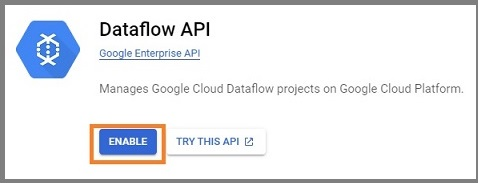
   
4. To grant privileges for your project to use Dataflow, search for **Service Accounts**.
    
    

5. Create a new service account.
    
    

6. As the service name is a global identifier, it’s a good practice to use the project id as a prefix as **ProjectID-DFSA**; the project ID can be copied from the console.
    
    

7. Add **Compute Engine Service Agent**  and **Pub/Sub Admin** as roles to the service account.

    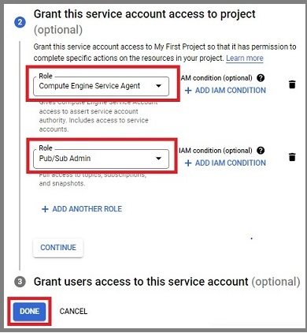

8. Now, it’s time to install the python library of DataFlow
    ``` cmd
    pip install pip --upgrade
    pip install 'apache-beam[gcp]'
    ```

   **Note**: this is a temporary installation into the GCP console. The GCP will be reset when the session expires, causing the temporary installations to be lost.

Now, we will go through four examples of Dataflow Jobs.

## 1. Running the wordcount Example
1.	After installing the **apache-beam[gcp]** library, Dataflow examples can be accessed from the Python library folder. The following command will search for the file containing the famous **wordcount** examples within any subdirectory of the home directory (**~**) and print it.

    ``` cmd
    find ~ -name 'wordcount.py'
    ```

2.	The following command will copy the file to the home directory (Replace path with the **path** you got from the previous step).

    ``` cmd
    cp path  ~/wordcount.py
    ```
    
    

3. Open the file using the text editor. Let's go through the wordcount.py script. As the user can send arguments to customize the processing, the first step is to parse those arguments. Thus, lines 69 to 73 define the first argument, which will be set in the calling command using the option **--input**. It's an optional argument; if not given, it will have the default value in line 72. The second argument is set using the **--output** option. It's required (not optional); thus, no default value is needed. After describing the arguments, line 79 will parse the arguments and return a dictionary (**known_args**) with two keys named by the **dest** parameter of the parsed arguments (**input** and **output**)

    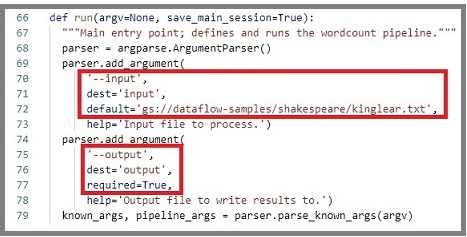
   
4.	The Dataflow pipeline is described from lines 87 to 106. It's instructions that will be given to a worker to execute. The dataflow will convert each stage into a function and associate a worker node to run it. The number of workers can be scaled by dataflow to satisfy suitable throughput demands.
    * Line 87 defines the root of the processing as a Python variable **p**.
              The first stage inserted after p (using the | operator) is given in line 90. It's called     Read, which runs a built-in function to read a text file. Note that the output will be a list of lines (strings) when executed. Note also that the pipeline till the first stage is saved into a Python variable named line.
    * The first stage inserted after **p** (using the **|** operator) is given in line 90. It's called **Read**, which runs a built-in function to read a text file. Note the output of this stage will be a list of lines (strings). Note also that until the first stage, the pipeline is saved into a Python variable named **line**.
    * The statements from lines 92 to 96 add three consequent stages.
        * The first is called **Split**, which splits each line into a list of words using a custom class implemented in lines 50:63.
        * The second is **PairWithOne**, which converts each word into a key/value pair in which the key is the word and the value is 1. This stage uses an inline function that takes a word **x** and returns the tuple **(x,1)**. 
        * The first two stages are Map operations which take a single input and produce a single or multiple outputs.
        * The third stage is a Reduce stage that will combine tuples having the same key (word) and then apply the **sum** function over the values to generate a new tuple of a word as a key and the count as the value. 
    * Line 102 append another stage to the pipeline. The stage implements another Map operation that executes a customized function defined in lines 99 and 100 to convert each tuple to a string.
    * A final stage saves the output (list of strings) to a text file.

    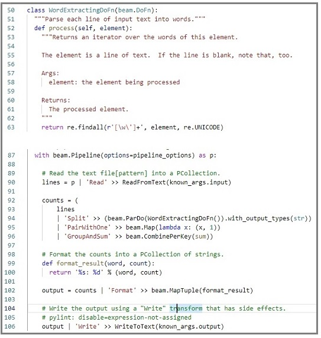
5.	To check the code, we can execute it locally (at the GCP console) by running the following command. As no input option is given, it will use the default value while the output will be saved in the home directory (current directory) with a prefix outputs.
5.	To check the code, we can execute it locally (at the GCP console) by running the following command. As no input option is given, it will use the default value while the output will be saved in the home directory (current directory) with a prefix **outputs**
    
    ``` cmd
    python wordcount.py --output outputs
    ```
    
    you can display the output file(s) using
    
    ``` cmd
    ls outputs*
    ```
    
    you can open the output file(s) with the text editor or using the Linux command
    
    ``` cmd
    cat outputs* | more
    ```

  	Note: you can use this local execution to debug the pipeline.
  	
7.	Now, let's run it as a GCP service to benefit from being globally available, managed, and auto-scaled by Dataflow. The first step is to get the project ID and save it to an environment variable (**$PROJECT**). (**Note**: the variable is also temporally and needs to be recreated if the console or the session is terminated)
    
    ``` cmd
    PROJECT=$(gcloud config list project --format "value(core.project)")
    echo $PROJECT
    ```
    
8. As the input and output paths should be globally accessed files, the Dataflow service will access a folder created in Google Cloud Storage. Resources in Google Cloud Storage, which act as a file system, are called Buckets. The following steps will lead you to create a Bucket.
    
    a) Search for **Buckets**

    
    
    b) Click **create**.

    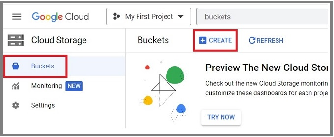
    
    c) As the name of the bucket is a unique global identifier, let’s use the project ID as a prefix as **ProjectID-bucket**. Then click **create**.

    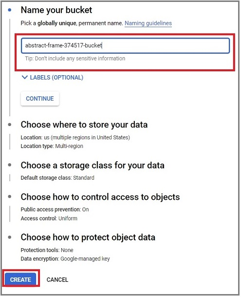
    
    d)	As only the service from our project will access the bucket, enable **public access prevention**.

    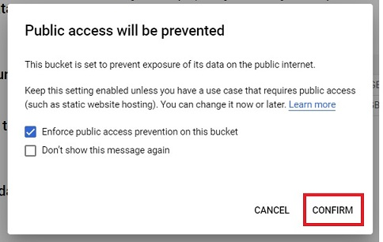
    
    e)	Create another environment variable for the bucket in the GCP console.
    
    ``` cmd
    BUCKET=gs://$PROJECT-bucket
    echo $BUCKET
    ```

    

9.	To run the pipeline using DataFlow, run the following command, 
    
    ``` cmd 
    python wordcount.py \
      --region northamerica-northeast2 \
      --runner DataflowRunner \
      --project $PROJECT \
      --temp_location $BUCKET/tmp/ \
      --input gs://dataflow-samples/shakespeare/winterstale.txt \
      --output $BUCKET/result/outputs \
      --experiment use_unsupported_python_version
    ```
    
    Some of the command arguments are needed by Dataflow to process the pipeline while others as input and output are used by the **wordcount** code to generate a customized pipeline. It will take **several minutes** for Dataflow to generate worker nodes, configure them, execute the pipeline, and finally it will display **JOB_STATE_DONE**.

    
  	
10.	To see the details about Dataflow Job, search for **Dataflow Jobs**, then choose the first one in the list (last job). A diagram of the pipeline will be displayed in which each stage is named as instructed in the python file. Note that, the name is unique and can’t be repeated for different stages. Also, the job info and logs are shown which can be used to debug the job. 
    
    

11. Go to the bucket created in step 7 and open the file(s) started by the prefix **outputs** within a folder named **result**. You can download the file to read it.

## 2. Running the wordcount2 Example

1. In the GitHub repository, there is an upgrade to the wordcount script, [wordcount2.py](/wordcount/wordcount2.py).

2. Before running the Dataflow job, let's examine the updates in the script
   * Lines 71-75: another argument for the job is defined under the name **output2**.
     
     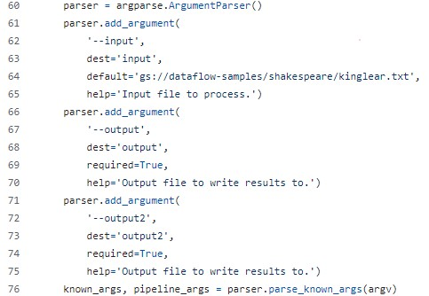
     
   * Line 84: defines the root of the Dataflow pipeline
   * Line 87: reads the file referenced by the **input** argument
   * Line 91: Split the file into words.
   * Line 92: Convert each work to lowercase.
   * All those operations are stored under the name **words**.
     
     
     
   * Lines 99-105: branches after the **words** stage
   * Line 100: filters out all the words that don't satisfy the condition of starting with letters from a to f.
   * Line 101: generates key/value pairs by associating each word with the count 1
   * Line 102: groups by the key (words) and sum the count.
   * Line 104: converts the key/value tuple into a string
   * Line 105 saves the strings into the text file referenced by the argument **output**.
     
     

   * Lines 107-111: another branch also starts after the **words** stage. Thus, this branch will run parallel (form a fork) with the branch described in lines 99-105.
   * Line 108: gets only the first letter from each word. 
   * Line 109: generates key/value pairs by associating each the starting letter in a word with the count 1
   * Line 110: groups by the key (letters) and sum the count.
   * Line 111: converts each key/value tuple into a string and saves it into the text file referenced by the argument **output2**.
     
     
     
3.	Make sure that the **PROJECT** and **BUCKET** environment variables remain. Then, clone the repository and run the updated script. Try to understand its function.
    ```cmd 
    cd ~
    git clone https://github.com/GeorgeDaoud3/SOFE4630U-MS3.git
    cd ~/SOFE4630U-MS3/wordcount
    PROJECT=$(gcloud config list project --format "value(core.project)")
    BUCKET=gs://$PROJECT-bucket
    python wordcount2.py \
      --region northamerica-northeast2 \
      --runner DataflowRunner \
      --project $PROJECT \
      --temp_location $BUCKET/tmp/ \
      --input gs://dataflow-samples/shakespeare/winterstale.txt \
      --output $BUCKET/result/outputs \
      --output2 $BUCKET/result/outputs2 \
      --experiment use_unsupported_python_version
    ```

4. The stages of the dataflow job are shown in the following figure

   

5. Go to the bucket created and open the file(s) started by the prefix **outputs** and **outputs2** within a folder named **result**. You can download the file to read it.
    
## Introduction to The MNIST dataset
The Modified National Institute of Standards and Technology (**MNIST**) dataset consists of handwritten digits that are commonly used for machine learning and image processing applications. Each digit is represented as a 28*28 gray image. The value of pixels ranges from 0 (white) to 255 (black) as shown in the following image. The values are normalized to 1, converted from a matrix to a vector, and stored as string. The string is fed to a Machine Learning (ML) model that estimates the probability of the digit represented by the image. The ML model is implemented using a Python library called **TensorFlow**. The detail of the model is behind the scope of this course. What you want to know is that the model parameters and the MNIST CSV are saved in a folder **/MNIST/data** in the repository.

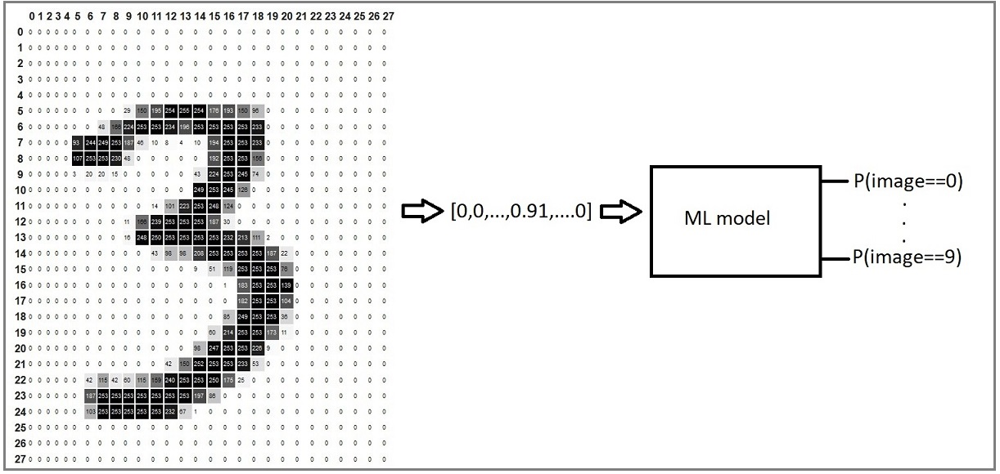

## 3. Batch Processing of the MNIST Dataset

**BigQuery** will be used to save the CSV file containing the MNIST dataset, as it can be accessed globally by the Dataflow workers. BigQuery is a cloud-based serverless data warehouse that supports SQL. First, a dataset, **MNIST**, will be created within the BigQuery. A table, **Images**, will be created within the dataset. The CSV file will be uploaded to fill the table. The Dataflow job will query each record from the table, run the ML model on each image, and produce a prediction of the handwritten digit. Finally, The Job will store the results in another table, **Predict**, within the same dataset.

1. Search for **BigQuery** Within the current project. Create a dataset and name it **MNIST**, create a table, name it **Images**, and upload the **mnist/data/mnist.csv** file from the repository (you need to download it first to your computer). It may take several minutes to create the dataset and the table.
   
    
    
2. Go to the bucket created before and upload the model folder from the **/mnist/model** folder from the repository.
3.	3.	Ensure the Project and Bucket environment variables are still defined. Then, run the DataFlow job using the following commands. 
    ``` cmd
    cd ~/SOFE4630U-MS3/mnist
    PROJECT=$(gcloud config list project --format "value(core.project)")
    BUCKET=gs://$PROJECT-bucket
    python mnistBQ.py \
      --runner DataflowRunner \
      --project $PROJECT \
      --staging_location $BUCKET/staging \
      --temp_location $BUCKET/temp \
      --model $BUCKET/model \
      --setup_file ./setup.py \
      --input $PROJECT.MNIST.Images \
      --output $PROJECT.MNIST.Predict\
      --region  northamerica-northeast2 \
      --experiment use_unsupported_python_version
    ```
    
    The Python code uses three arguments to create a customized pipeline:
    
    a)	**input** that specifies the table name from which to read the data, which follows the following pattern: **ProjectID.Dataset.Table**
    
    b)	**output** that specifies the table name to be created to store the predicted values.
    
    c)	**model** that specifies the path from which the model parameters can be read.

    Another important argument is **setup_file**. It specifies the libraries needed to be installed on each worker. The following figure shows the list of commands in the **setup_file** that will be executed to initiate each worker. The list contains only one command to install the **TensorFlow** library required to run the model. Note: Installing dependencies will consume time when initiating each worker node. Another approach is to provide a docker image with preinstalled dependencies. This will reduce the launch time of the worker nodes and the job.
    
    
    
4.	As shown in the following image, the pipeline consists of 3 stages:
    
    a.	**ReadFromBQ**: that reads a BigQuery table.
    
    b.	**Prediction**: that calls the process function defined within the PredictDoFn class to process each record (row) and returns a dictionary that contains the following fields; **ID**, **P0**, …, **P9** where **ID** is the same as the record ID of the input table, **P0** is the probability that the image represents the digit 0,… . Note that the **@singleton** annotation in line 36 will prevent the model creation to just once, which will make the process function run fast. Also, the second argument (**known_args.model**) is in line 86 ndawill be the last argument sent to the process function (**checkpoint**).
    
    c.	**WriteToBQ**: that writes the prediction output (**ID**, **P0**, …, **P9**) into another BigQuery table. The table will be created if it does not exist and will be truncated if it exists.
    
    
  	
5.	A new table has been created in the MNIST dataset. To display its content, follow the steps in the following figure.

    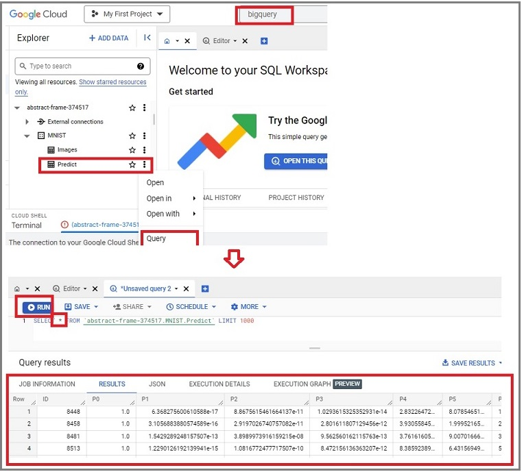

**Note**: The initialization of the Dataflow job takes a lot of time because of the setup.py file. A fast alterantive is to build a docker image and use it for the job workers. More information can be found in [Build custom container images for Dataflow](https://cloud.google.com/dataflow/docs/guides/build-container-image)

## 4. Stream Processing the MNIST Dataset

In this example, the data will be read and stored in Google Pub/Sub, as shown in the following figure. Because this is a streaming process, it will keep running until you manually stop it.


    
1. Create two topics **mnist_image**, and **mnist_predict** at **Google Pub/Sub**.
2. Run the Data flow job that reads JSON objects from the **mnist_image** topic, apply it to the ML model, and send the prediction results via the **mnist_predict** topic.
    ``` cmd
    cd ~/SOFE4630U-MS3/mnist
    PROJECT=$(gcloud config list project --format "value(core.project)")
    BUCKET=gs://$PROJECT-bucket
    python mnistPubSub.py \
      --runner DataflowRunner \
      --project $PROJECT \
      --staging_location $BUCKET/staging \
      --temp_location $BUCKET/temp \
      --model $BUCKET/model \
      --setup_file ./setup.py \
      --input projects/$PROJECT/topics/mnist_image	\
      --output projects/$PROJECT/topics/mnist_predict \
      --region  northamerica-northeast2 \
      --experiment use_unsupported_python_version \
      --streaming
    ````

   **Note**: A new argument **streaming** is used here to mark the pipeline as a streaming process. So it will run forever until you manually stop it.

3. The job pipeline consists of five stages:

    a.	**Read from Pub/Sub**: reads messages from the input topic.

    b.	**toDict**: Pub/Sub is agnostic to the message type. The message is handled as a stream of bytes. To process the message, The stage deserializes the message from bytes to its original format (JSON).

    c.	**Prediction**: the same as the Prediction in the BigQuery example.

    d.	**To byte**: serializes the predicted output to bytes.
    
    e.	**To Pub/sub**: sends the serialized prediction to the output topic.
    
    

4. Download the [/mnist/data/](/mnist/data/) folder into your computer and copy the service account key with the Pub/Sub roles created in the first milestone to the folder.

5. Set the project ID in line 17 in **/mnist/data/producerMnistPubSup.py** on your computer. The script creates a producer that sends each record from the mnist dataset as a message every 0.1 seconds. Run the **producerMnistPubSup.py** script.

6. Set the project ID in line 11 in **/mnist/data/consumerMnistPubSup.py** on your computer. The script consumes messages from the mnist_predict topic, converts them to JSON, and displays them. Run the script. You should start seeing the prediction of the MNIST images printed on the screen.


    It may take minutes until everything is set up. The whole example can be summarized as:
        * The producer produces messages of handwritten digits to the mnist_image topic.  ( your local machine)
        * The Dataflow job will read messages, process them, and send them to the mnist_predict topic ( in GCP)
        * The consumer will consume every result from the mnist_predict topic and display it.  ( your local machine)

7. **Note** that as the Dataflow job is marked as streaming, it will continue running. To stop it, go to the Dataflow job and stop it manually.
   
    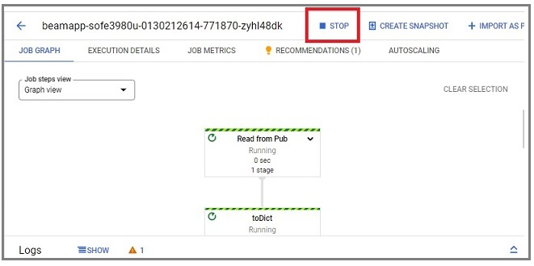


## Design
The Design problem is described at [https://github.com/GeorgeDaoud3/SOFE4630U-Design](https://github.com/GeorgeDaoud3/SOFE4630U-Design). You already have implemented the ingestion and storage in the first two milestones. In this milestone, we will start in the processing part. You are required to implement the <a href='https://github.com/GeorgeDaoud3/SOFE4630U-Design/blob/main/README.md#milestone-3'> milestone 3</a> part and run it a Dataflow job.
 
## Deliverables
1. A report including the four Dataflow examples (wordcount and MNIST) and a description of the implementation of the design part. It should include proof of a successful deployment of the dataflow Job and provide some results.
2. An audible video of about 4 minutes showing the created job and the results of the four examples (wordcount and MNIST).
3. Another audible video of about 3 minutes showing the design part.
4. A GitHub link of the code, Dockerfile, and results of the design part.

**Note**: you will represent the Design part of this milestone in the lecture.
